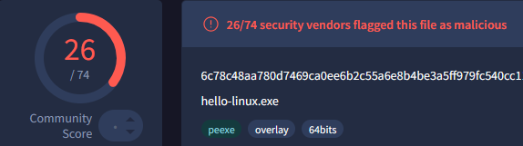
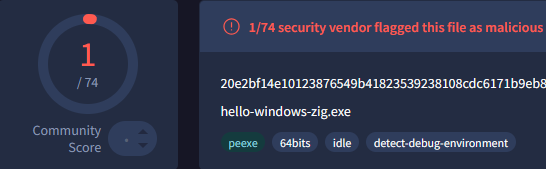
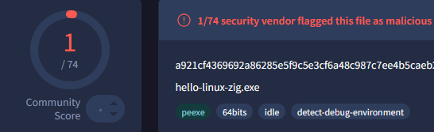

# Nim + Zig = ❤️

I like Nim, it allows me to build C like programs without having to suffer through learning C. It's fun to write in, has python like syntax, great FFI and an even better Windows library called [Winim](https://github.com/khchen/winim).

Plus, cool people have already written stuff in nim :
- [https://github.com/byt3bl33d3r/OffensiveNim](https://github.com/byt3bl33d3r/OffensiveNim)
- [https://github.com/chvancooten/NimPlant](https://github.com/chvancooten/NimPlant)
- [https://github.com/S3cur3Th1sSh1t/NimGetSyscallStub](https://github.com/S3cur3Th1sSh1t/NimGetSyscallStub)
- [https://github.com/icyguider/Nimcrypt2](https://github.com/icyguider/Nimcrypt2)
- and more


### Introduction

<<<<<<< HEAD
A lot of malware has been written in Nim[1] (see list above) and this has caused some frustration on the Nim forums and Nim's github page [2][3][4] about anti-virus detecting normal programs developed in this language.
=======
<<<<<<< HEAD
A lot of malware has been written in Nim[1] (see list above) and this has caused some frustration on the Nim forums and Nim's github page [2][3][4] about anti-virus detecting normal programs developed in this language.
=======
A lot of malware has been written in Nim[1] (see list above) and this has cause some frustation on the Nim forums and Nim's github page [2][3][4] about anti-virus detecting normal programs developped in this language.
>>>>>>> 4ef2826 (Updated with:  516f2bd)
>>>>>>> 4b589c7 (Updated with:  be93566)


[1] [Decoy Microsoft Word Documents Used to Deliver Nim-Based Malware](https://thehackernews.com/2023/12/decoy-microsoft-word-documents-used-to.html). <br>
[2] [Why I stopped programming in Nim](https://forum.nim-lang.org/t/9850)<br>
[3] [Anti-virus at work prevents the use of Nim binaries](https://forum.nim-lang.org/t/9388)<br>
[4] [Check Nim's binaries aren't Virus](https://github.com/nim-lang/Nim/issues/17820)<br>

Having a legitimate Nim binary already flagged as malware is a bad start. It's especially an issue if we want to continue developping offensive tools with Nim.  *As if developing offensive tools hadn't created the issue we now want to avoid.*


### How does Nim's compilation process work ?

Nim generates C code that then gets compiled by the compiler installed on your system, *gcc*, *clang* or *x86_64-w64-mingw32-gcc*.

The configuration file *nim.cfg* contains the logic to choose which compiler to use. [5]

```bash
# Example from the config file
@if unix and mingw:
  # Cross compile for Windows from Linux/OSX using MinGW
  [SNIP]
  amd64.windows.gcc.exe = "x86_64-w64-mingw32-gcc"
  amd64.windows.gcc.linkerexe = "x86_64-w64-mingw32-gcc"
  amd64.windows.gcc.cpp.exe = "x86_64-w64-mingw32-g++"
  amd64.windows.gcc.cpp.linkerexe = "x86_64-w64-mingw32-g++"
```
You can also specify the compiler to use on the command line :

`nim c --cc:clang --clang.exe="x86_64-w64-mingw32-clang" --clang.linkerexe="x86_64-w64-mingw32-clang" --passc:"stuff" --passl:"stuff"` 


[5] [https://nim-lang.org/docs/nimc.html#compiler-selection](https://nim-lang.org/docs/nimc.html#compiler-selection)


By default, compiling on Windows or cross-compiling on Linux, the detection rates match what the Nim devs were complaining about.

Simple program :
```nim
import winim
import std/strformat

var
    buffer = newMString(UNLEN + 1)
    cb = DWORD buffer.len

GetUserNameA(&buffer, &cb)
buffer.setLen(cb - 1)
MessageBox(0, fmt"Hello {buffer} !", "Nim is Powerful", 0)
```

 Detections :

<table>
    <tr>
        <td style="border: 0;"><p>Compiling on Windows</p></td>
        <td style="border: 0;"><p>Cross-Compiling on Linux</p></td>
    </tr>
</table>


<<<<<<< HEAD
I was therefore curious if using a non-default compiler reduced anti-virus detections so I could keep using Nim for all my *perfectly legitimate* projects.

### Where does Zig come in ?


Since we can use whatever compiler we want from Nim, I thought we could use Zig's compiler [6].  
=======
<<<<<<< HEAD
I was therefore curious if using a non-default compiler reduced anti-virus detections so I could keep using Nim for all my *perfectly legitimate* projects.
=======
I was therefore curious if using a non-default compiler would reduce anti-virus detections so I could keep using Nim for all my *perfectly legitimate* projects.
>>>>>>> 4ef2826 (Updated with:  516f2bd)

### Where does zig come in ?


<<<<<<< HEAD
Since we can use whatever compiler we want from Nim, I thought we could use Zig's compiler [6].  
=======
Since we can use whatever compiler we want from Nim, I though we could use Zig's compiler [6].  
>>>>>>> 4ef2826 (Updated with:  516f2bd)
>>>>>>> 4b589c7 (Updated with:  be93566)
But wait, you might ask, isn't Zig a language of its own, how or why can it compile C code ?

[6] [https://ziglang.org/learn/overview/](https://ziglang.org/learn/overview/)

Well, *Zig (Zig CC)* is described by its lead developer Andrew Kelley as *a Powerful Drop-In Replacement for GCC/Clang* [7]. We can use Zig to compile C code, and a bunch of other things too [7.1]. In addition, it comes with incredible cross-compilation features. 


[7] [https://andrewkelley.me/post/zig-cc-powerful-drop-in-replacement-gcc-clang.html](https://andrewkelley.me/post/zig-cc-powerful-drop-in-replacement-gcc-clang.html)<br>
[7.1] [https://medium.com/@edlyuu/zig-c-c-compiler-wtf-is-zig-c-790d9ad8d85b](https://medium.com/@edlyuu/zig-c-c-compiler-wtf-is-zig-c-790d9ad8d85b)


<<<<<<< HEAD
This means we can use Zig to compile our Nim program, we just need a way to tell Nim to use Zig. Thankfully, someone else already did the leg work [8], and published a nimble package to help with this. 
=======
<<<<<<< HEAD
This means we can use Zig to compile our Nim program, we just need a way to tell Nim to use Zig. Thankfully, someone else already did the leg work [8], and published a nimble package to help with this. 
=======
This means we can use Zig to compile our Nim program, we just need a way tell Nim to use Zig. Thankfully, someone else already did the leg work [8], and published a nimble package to help with this. 
>>>>>>> 4ef2826 (Updated with:  516f2bd)
>>>>>>> 4b589c7 (Updated with:  be93566)

[8] [https://github.com/enthus1ast/zigcc](https://github.com/enthus1ast/zigcc)

You can also follow the stackoverflow link on the Github page and compile your own version (is what I did). 

Once the helper program installed or compiled, we can use Zig with Nim when targeting Windows with the following commands :


```bash
# On Linux
nim c --cc:clang --clang.exe="zigcc" --clang.linkerexe="zigcc" --passc:"-target x86_64-windows-gnu" --passl:"-target x86_64-windows-gnu" --forceBuild:on --os:windows --out:hello-linux-zig.exe hello.nim
# On Windows
nim c --cc:clang --clang.exe="zigcc" --clang.linkerexe="zigcc" -o:hello-windows-zig.exe hello.nim
```


The detection rate speak for themselves. 

<table>
    <tr>
        <td style="border: 0;"><p>Compiling on Windows with Zig</p></td>
        <td style="border: 0;"><p>Cross-Compiling on Linux with Zig</p></td>
    </tr>
</table>

<<<<<<< HEAD
Disclaimer: I haven't (yet) tried this on more significant Nim projects, but I see no reason why it wouldn't work.
=======
<<<<<<< HEAD
Disclaimer: I haven't (yet) tried this on more significant Nim projects, but I see no reason why it wouldn't work.
=======
Disclamer: I haven't (yet) tried this on more significant Nim projects, but I see no reason that it wouldn't work.
>>>>>>> 4ef2826 (Updated with:  516f2bd)
>>>>>>> 4b589c7 (Updated with:  be93566)

### Dockerfile

Here's a Dockerfile that installs Zig, Nim and some Nimble packages :
```Dockerfile
FROM alpine:3.20

RUN apk update && \
apk add --no-cache build-base git zig nim nimble && \
rm -rf /var/cache/apk/* && \
nimble install -y winim nimcrypto ptr_math zigcc && \
mkdir /build && mkdir /src

ENV PATH="${PATH}:/root/.nimble/bin"
CMD ["/bin/sh"]
```

You can use it like this :
```bash
docker run -v "`pwd`:/src" -v "`pwd`:/build" nim-zig-docker nim c --cc:clang --clang.exe="zigcc" --clang.linkerexe="zigcc" --passc:"-target x86_64-windows-gnu" --passl:"-target x86_64-windows-gnu" --forceBuild:on --os:windows --out:./build/hellowindows.exe ./src/hello.nim
```
and probably make it better by having an entrypoint script to manage the argument list.


--------------------

Thanks for reading,<br>
Fudge...
<p>
> Created on : 12.09.2024 <br/>
</p>