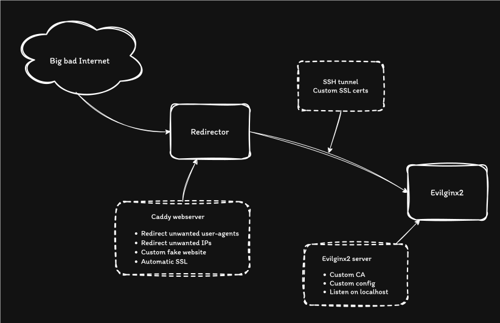
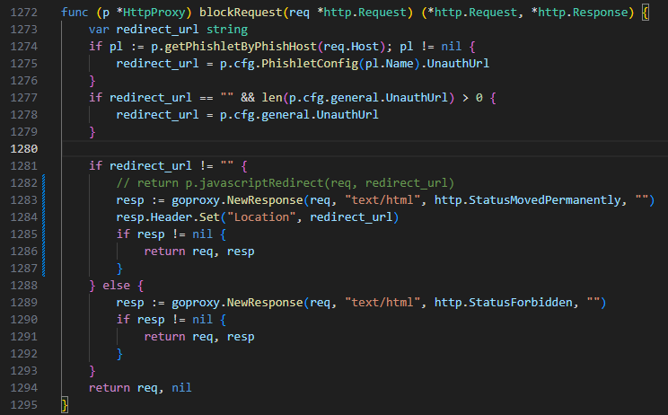

# Building Phishing Infrastructure With Terraform and Ansible

This is an article about building phishing or really any kind of pentest/red team infrastructure using Terraform and Ansible. We'll go over the architecture, Terraform setup and Ansible tasks that make it possible to build reliable and secure infrastructure. 

## Architecture / Design

Here's a diagram of the architecture. 

<p style="text-align: center;">

</p>

We are using two separate servers for *redirector* and *evilginx2*, following the usual design for C2 infrastructure. This design prevents *Evilginx2* from being exposed directly on the Internet, and gives us the option to replace the redirector in case the domain gets flagged without having to redeploy, reconfigure and retest the entire infrastructure.  


We'll see details on each segment later. 


## Terraform and Ansible

We'll use Terraform and Ansible to deploy this design, DevOps teams can't have all the fun. 


I'll skip the Terraform part because the setup will depend on the cloud provider you'll use. 

*Ensure that you configure the instances with an SSH key that is readily available on the machine where you'll be running Ansible.*

The most important part is to setup DNS correctly, in my DigitalOcean config, this looks like this:
```yaml
resource "digitalocean_domain" "domain" {
  name = var.domain_name
}

resource "digitalocean_record" "wildcard" {
  domain = digitalocean_domain.domain.id
  type   = "A"
  name   = "*"
  ttl = 1800
  value  = digitalocean_droplet.evilginx["redirector"].ipv4_address
}

resource "digitalocean_record" "a" {
  domain = digitalocean_domain.domain.id
  type   = "A"
  name   = "@"
  ttl = 1800
  value  = digitalocean_droplet.evilginx["redirector"].ipv4_address
}
```

This will ensure that the domain and subdomains will point to our redirector IP. Notice that we don't use the evilginx server IP or change the NS record. 


For Ansible, we'll discuss the directory structure here, and the details of the main tasks in the next chapters. 

```
.
├── evilginx2.yml
├── hosts.yml
├── redirector.yml
├── site.yml
└── roles
    ├── common
    │   ├── tasks
    │   │   ├── main.yml
    │   │   └── prerequisites.yml
    │   └── vars
    │       └── main.yml
    ├── evilginx
    │   ├── files
    │   │   ├── docker-compose.yml
    │   │   └── evilginx2
    │   │       └── config
    │   │           └── config.j2
    │   ├── tasks
    │   │   ├── firewall.yml
    │   │   ├── generate_certs.yml
    │   │   ├── main.yml
    │   │   ├── prerequisites.yml
    │   │   └── setup_evilginx2.yml
    │   └── vars
    │       └── main.yml
    └── redirector
        ├── files
        │   ├── caddy
        │   │   ├── caddy
        │   │   ├── Caddyfile.j2
        │   │   ├── caddy.service
        │   │   └── filters
        │   │       ├── bad_ips.caddy
        │   │       ├── bad_ua.caddy
        │   │       ├── headers_standard.caddy
        │   │       └── tls.caddy
        │   ├── tunnels
        │   │   └── autossh_https_service.j2
        │   └── template_website
        │       └── template1
        ├── tasks
        │   ├── firewall.yml
        │   ├── main.yml
        │   ├── setup_caddy.yml
        │   ├── ssh_portfwd.yml
        │   ├── start_caddy.yml
        │   └── webserver.yml
        └── vars
            └── main.yml
```

This recommended directory setup from Ansible helps manage servers with different roles. In this case, the site.xml imports the host playbooks : 
```yaml
- import_playbook: evilginx2.yml
- import_playbook: redirector.yml
```

Each playbook contains the host on which role tasks can be executed. 
```yaml
- hosts: evilginx
  roles:
    - common
    - evilginx
```
Here, we target evilginx hosts with the *common* and *evilginx* roles. In the tree command output above, we can see the *common*, *evilginx* and *redirector* roles. 

Every role directory contains: 
- **files** - for static or template files
- **tasks** - for ansible tasks
- **vars** - for role-specific variables

In the task directory, the *main.yml* file will be executed by Ansible automatically. We can split up tasks and use `include_tasks` in *main.yml* to import them. 

```yaml
- include_tasks: prerequisites.yml
- include_tasks: generate_certs.yml
- include_tasks: setup_evilginx2.yml
- include_tasks: firewall.yml
```


This structure also means that we can either configure all the servers using *site.xml* or each individual hosts with their respective playbooks. 

```bash
ansible-playbook -u root -i hosts.yml site.yml
ansible-playbook -u root -i hosts.yml <evilginx2.yml or redirector.yml>
```

Finally, the *hosts.yml* file contains a list of IPs per role :
```yaml
redirector:
  hosts:
    164.92.212.233:
evilginx:
  hosts:
    164.92.210.139:
```

## Evilginx2 configuration


#### Custom CA

The diagram shows that we are using a custom CA for Evilginx. We do this to generate our own certs instead of letting Evilginx2 request them from LetsEncrypt, or use the `-developer` argument that will generate self-signed certs. While this argument seems to be the solution to generate certs, they are`ca.crt` `ca.key`only created when launching Evilginx, which is a problem when deploying our infrastructure as we won't have access to these keys to configure our redirector to trust Evilginx2's developer certs. 

Instead, we can create our own CA, generate certs for the domain and subdomains (as a wildcard) and install them as *@mrgretzky*'s tweet explains [https://x.com/mrgretzky/status/1763584080245887320?t=QXA0bqeBrNP4xn8RoA1jfw&s=31](https://x.com/mrgretzky/status/1763584080245887320?t=QXA0bqeBrNP4xn8RoA1jfw&s=31): 
```
1. Put your certificate and private key in: ~/.evilginx/crt/sites/<anyname>/
2. Disable LetsEncrypt with: `config autocert off`
3. Profit! (wildcard certs supported)
```


```yaml
# source: https://gist.github.com/klo2k/6506d161e9a096f74e4122f98665ce70
- name: Generate Certificate Authority (CA) self-signed certificate
  block:
    - name: Generate Root CA private key
      openssl_privatekey:
        path: "/root/certs/ca.key"

    - name: Generate Root CA CSR
      openssl_csr:
        path: "/root/certs/ca.csr"
        privatekey_path: "/root/certs/ca.key"
        common_name: "{{openssl_csr_common_name}}"
        organization_name: "{{openssl_csr_organization_name}}"
        basic_constraints:
          - CA:TRUE
        basic_constraints_critical: yes
        key_usage:
          - keyCertSign
          - digitalSignature
          - cRLSign
        key_usage_critical: yes

    - name: Generate Root CA certificate
      openssl_certificate:
        path: "/root/certs/ca.crt"
        privatekey_path: "/root/certs/ca.key"
        csr_path: "/root/certs/ca.csr"
        provider: selfsigned

- name: Generate domain key, CSR and self-signed certificate (using own CA)
  block:
    - name: Generate host/internal domain private key
      openssl_privatekey:
        path: "/root/certs/{{cert_common_name}}.key"

    - name: Generate host/internal domain CSR
      openssl_csr:
        path: "/root/certs/{{cert_common_name}}.csr"
        privatekey_path: "/root/certs/{{cert_common_name}}.key"
        common_name: "{{cert_common_name}}"
        subject_alt_name: "{{cert_subject_alt_name}}"
        organization_name: "{{openssl_csr_organization_name}}"

    - name: Generate host/internal domain certificate (with own self-signed CA)
      openssl_certificate:
        path: "/root/certs/{{cert_common_name}}.hostonly.crt"
        csr_path: "/root/certs/{{cert_common_name}}.csr"
        ownca_path: "/root/certs/ca.crt"
        ownca_privatekey_path: "/root/certs/ca.key"
        ownca_not_after: "{{ownca_not_after}}"
        provider: ownca

    - name: Generate host/internal domain certificate (with own self-signed CA) - with full chain of trust
      ansible.builtin.shell: "cat /root/certs/{{cert_common_name}}.hostonly.crt /root/certs/ca.crt > /root/certs/{{cert_common_name}}.crt"
```

We use the *vars* directory in the *evilginx* role to store the variables for the certs:
```yaml
cert_common_name: "{{ domain }}"
cert_subject_alt_name: "DNS:*.{{ domain }}"
ownca_not_after: "+397d"
openssl_csr_common_name: "My CA"
openssl_csr_organization_name: "My Organisation"
```
I'll let you figure out the Ansible task to copy the certs to Evilginx's directory. 


#### Docker Compose

In order to easily make updates to the source code of Evilginx2, I have a CICD pipeline that automatically builds a docker image and pushes it to DigitalOcean's registry. We can now, from Ansible, authenticate to the registry and pull the image. 

Authenticating to the registry:
```yaml
- name: Fetch docker creds
  ansible.builtin.command:
    cmd: >-
      curl -s -H "Authorization: Bearer {{ lookup('env', 'DIGITALOCEAN_TOKEN') }}"
      "https://api.digitalocean.com/v2/registry/docker-credentials?expiry_seconds=600"
  delegate_to: localhost
  register: docker_creds

- name: Upload Docker login file
  ansible.builtin.copy:
    content: "{{ docker_creds.stdout }}"
    dest: /root/.docker/config.json
    mode: '0600'

```
The docker compose file used to deploy the image: 

```yaml
services:
  evilginx2:
    container_name: my_evilginx2
    image: registry.digitalocean.com/my-registry/my-evilginx2
    restart: always
    volumes:
      - /opt/evilginx2/phishlets:/volume/phishlets 
      - /opt/evilginx2/redirectors:/volume/redirectors
      - /opt/evilginx2/config:/root/.evilginx/
    ports:
      - "127.0.0.1:8443:8443"
    command: ["sleep", "infinity"]
```
We mount the `/opt/evilginx2/config`directory to `/root/.evilginx/`upload our own configuration file from Ansible. Phishlets and redirectors directories are also mounted in case we need to use a phishlet that isn't built into the image. 


#### Redirect IOC

Just something I found when playing around with this reverse proxy setup. 

Evilginx2 has the option to redirect blacklisted IPs to an unauth URL, protecting your links. Using curl to make a HTTP request from an IP that is blacklisted will return a **200 OK** with this odd HTML body. 
```html
> GET / HTTP/1.1
> Host: academy.testing-domain.ch:8443
> User-Agent: curl/7.88.1
> Accept: */*
>
< HTTP/1.1 200 OK
< Cache-Control: no-cache, no-store
< Connection: close
< Content-Type: text/html
< Transfer-Encoding: chunked

<html><head><meta name='referrer' content='no-referrer'><script>top.location.href='https://www.youtube.com/watch?v=dQw4w9WgXcQ';</script></head><body></body></html>
```

Searching Google and Shodan for this HTML doesn't return any interesting results, but GitHub search finds this :


We should change the code in *http_proxy.go* to return a 301 :




Now this looks like a normal **301 Moved Permanently** :
```
> GET / HTTP/1.1
> Host: academy.testing-domain.ch:8443
> User-Agent: curl/7.88.1
> Accept: */*
>
< HTTP/1.1 301
< Cache-Control: no-cache, no-store
< Connection: close
< Content-Type: text/html
< Location: https://www.youtube.com/watch?v=dQw4w9WgXcQ
< Transfer-Encoding: chunked
```


## Redirector configuration

Firstly, we'll configure Caddy as our reverse proxy, here's an example configuration that provides automatic SSL with wildcard support, IP and user-agent denylist and our reverse proxy. 
```yaml
*.{{ domain }}:443 {
	import ./filters/tls.caddy
	encode gzip
	header {
		import ./filters/headers_standard.caddy
	}
	handle {
		@ip_denylist {
		 	import ./filters/bad_ips.caddy
		}
		@ua_denylist {
		 	import ./filters/bad_ua.caddy
		}
		route @ip_denylist {
		 	file_server {
		 		root /var/www/html/{{ domain }}
		 	}
		}
		route @ua_denylist {
		 	file_server {
		 		root /var/www/html/{{ domain }}
		 	}
		}
		handle {
			reverse_proxy https://localhost:8000  {
				header_up Host {http.request.hostport}
				transport http {
					tls_server_name {http.request.hostport} # for SNI
					tls_trust_pool file /opt/caddy/ca.crt
				}
			}
		}
	}
}

{{ domain }}:443 {
	import ./filters/tls.caddy
	encode gzip
	header {
		import ./filters/headers_standard.caddy
	}
	file_server {
		root /var/www/html/{{ domain }}
	}
}
```

#### Reverse proxy

We need to add a few statements to the *reverse_proxy* option. 


> **tls_server_name** sets the server name used when verifying the certificate received in the TLS handshake. By default, this will use the upstream address' host part. <p>
You only need to override this if your upstream address does not match the certificate the upstream is likely to use. For example, if the upstream address is an IP address, then you would need to configure this to the hostname being served by the upstream server.<p>
A request placeholder may be used, in which case a clone of the HTTP transport config will be used on every request, which may incur a performance penalty.*

If we don't set the *SNI* with `tls_server_name` and send a request with `curl https://academy.testing-domain.ch`, Evilginx2 receives the request like so: 

```
[dbg] Got connection
[dbg] SNI: localhost
[dbg] fn_IsActiveHostname: Hostname: localhost
[dbg] fn_IsActiveHostname: Hostname: [academy.testing-domain.ch]
[dbg] TLS hostname unsupported: localhost
```
With the `tls_server_name`configured, the hostname is correctly determined by Evilginx2. 
```
[dbg] Got connection
[dbg] SNI: academy.testing-domain.ch
[dbg] fn_IsActiveHostname: Hostname: academy.testing-domain.ch
[dbg] fn_IsActiveHostname: Hostname: [academy.testing-domain.ch]
[dbg] Fetching TLS certificate for academy.breakdev.org:443 ...
[dbg] isWhitelistIP: 127.0.0.1-example
```

The host is parsed using `vhost.TLS(c)` from the *https://github.com/inconshreveable/go-vhost* library. 
```go
tlsConn, err := vhost.TLS(c)
if err != nil {
  log.Debug("TLS conn failed")
  return
}
log.Debug("SNI: %s", tlsConn.Host())
hostname := tlsConn.Host()
if hostname == "" {
  log.Debug("TLS hostname is empty")
  return
}
if !p.cfg.IsActiveHostname(hostname) {
  log.Debug("TLS hostname unsupported: %s", hostname)
  return
}
```
Changing the code to attempt to extract the host header from the HTTP connection seems to return the raw SSL data. I didn't spend much time looking into it. 
`Not a valid http connection!: malformed HTTP request "\x16\x03\x01\x05\xdc\x01\x00\x05\xd8\x03\x03FĘ\x02#\xab\0"`. 


Some of you probably noticed the `reverse_proxy https://localhost:8000`, forwarding requests to localhost ? We are using SSH port forwarding to "smuggle" our HTTPS traffic through the Internet towards our Evilginx server. Nothing new here, you could do the same when tunneling C2 traffic. 


We can use the excellent *autossh* tool to create our ssh tunnel, forwarding our local port 8000 to the remote port 8443. Some SSH options with `-o` are used here, as the [documentation](https://linux.die.net/man/1/autossh) suggests.

```bash
[Unit]
Description=Forwarding localhost:8000 to remote localhost:8443
After=network-online.target

[Service]
Type=simple
User=root
Environment=PATH=/usr/local/sbin:/usr/local/bin:/usr/sbin:/usr/bin
ExecStart=autossh -M 0 -NC -o "ExitOnForwardFailure=yes" -o "ServerAliveInterval=10" -o "ServerAliveCountMax=3" -o "StrictHostKeyChecking=accept-new" -L 127.0.0.1:8000:127.0.0.1:8443 -i ~/.ssh/evilginx2-user evilginx2@{{ evilginx_ip }}
Restart=always
RestartSec=5

[Install]
WantedBy=multi-user.target
```

Here are the Ansible tasks to configure this port forward :
```yaml
- name: Create evilginx2's ssh keys
  openssh_keypair:
    path: ~/.ssh/evilginx2-user
    comment: "evilginx2-user"
    type: ecdsa
    size: 384
    state: present
  register: sshkeys

- name: Update evilginx host authorized_keys
  delegate_to: "{{ groups['evilginx'][0] }}"
  authorized_key:
    state: present 
    user: evilginx2
    key: "{{ sshkeys.public_key }}"

- name: Upload autossh "https" service
  template:
    src: ../files/tunnels/autossh_https_service.j2
    dest: /etc/systemd/system/autossh_https.service
    owner: root
    group: root
    mode: '0644'

- name: Start autossh "https" service
  ansible.builtin.systemd_service:
    name: autossh_https
    state: restarted
    enabled: true
```

Since this task will run from the redirector role, we need to use *delegate_to* to target the evilginx host for the *Update evilginx host authorized_keys* task.  


> **trust_pool** configures the source of certificate authorities (CA) providing certificates against which to validate client certificates.*

We also need to set the `trust_pool` as we generate our own custom certificates (in the **Evilginx2** chapter) and need to tell Caddy to trust the certs it's going to see when proxying requests. 


Here's part of the Ansible task that uploads the configuration file, and copies the CA cert generated on the evilginx host :
```yaml
- name: Upload Caddyfile
  template:
    src: ../files/caddy/Caddyfile.j2
    dest: /opt/caddy/Caddyfile
    owner: caddy
    group: caddy
    mode: '0644'

- name: Copy CA cert from evilginx
  delegate_to: "{{ groups['evilginx'][0] }}"
  ansible.builtin.slurp:
    src: "/root/certs/ca.crt"
  register: ca_cert

- name: Push CA cert to redirector
  ansible.builtin.copy:
      content: "{{ ca_cert.content | b64decode }}"
      dest: "/opt/caddy/{{ ca_cert.source | basename }}"
```


### Fake website

We want to redirect unauthenticated, unwanted and overall bad IPs or user-agents that want our phishing engagements to fail to a fake website. 


```yml
- name: Create webroot directory
  ansible.builtin.file:
    path: /var/www/html/{{ domain }}
    state: directory
    owner: caddy
    group: caddy
    mode: '0744'

- name: Archive the content of the template website
  delegate_to: localhost
  ansible.builtin.archive:
    path: "{{ role_path }}/files/template_website/{{ website }}/*"
    dest: "{{ role_path }}/files/template_website/{{ website }}.tar.gz"


- name: Unarchive template website onto remote host
  ansible.builtin.unarchive:
    src: "{{ role_path }}/files/template_website/{{ website }}.tar.gz"
    dest: /var/www/html/{{ domain }}
    owner: caddy
    group: caddy

- name: Remove local website template archive
  delegate_to: localhost
  file: 
    path: "../files/template_website/{{ website }}.tar.gz"
    state: absent
```
Archiving the entire directory before upload is necessary, otherwise it takes Ansible too long to copy all the files. 


## Conclusion

This article should show an example of how we can use DevOps tools to deploy and manage our infrastructure. 

This isn't new, I remember reading Rasatmouse's 2021 blog a while back about Terraform and Ansible [https://rastamouse.me/infrastructure-as-code-terraform-ansible/](https://rastamouse.me/infrastructure-as-code-terraform-ansible/), and Marcello's blog [https://byt3bl33d3r.substack.com/p/taking-the-pain-out-of-c2-infrastructure](https://byt3bl33d3r.substack.com/p/taking-the-pain-out-of-c2-infrastructure), or APTortellini's blog [https://aptw.tf/2021/11/25/c2-redirectors-using-caddy.html](https://aptw.tf/2021/11/25/c2-redirectors-using-caddy.html) that both talked about Caddy as a reverse proxy for Red Team operations. 
I've also seen InfoSec folks discuss RedTeam infra on Twitter that sparked the idea of building such a thing on my own. 

Thanks to all these people ! 


--------------------

Thanks for reading,<br>
Fudge...

> Created on : 17.03.2025

