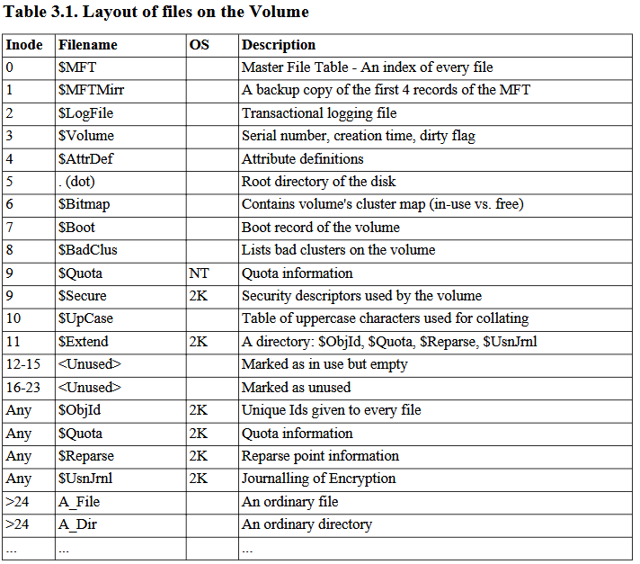

# Rawdogging NTFS in Nim

I saw this tweet from **@0xcc00** [https://x.com/0xcc00/status/1842592744021328314](https://x.com/0xcc00/status/1842592744021328314) talking about extracting SAM, SECURITY files from the NTFS volume instead of using WinAPI. 

Furthermore, a comment from **bugch3ck** sent me into a google search battle to find this library:
```
This is what Invoke-NinjaCopy in PowerSploit does, parsing NTFS in a DLL loaded reflectively. With the right libs you can do this in 5 lines of .NET code.
```

*google search battle* is a bit too harsh, while writing this article, I found it in one google search, I swear it took me a while the first time. 

[1] https://github.com/rasberry/NTFSDirect

And look at these beautiful five lines from the readme:
```c#
string vol = "c:";
var fileList = new NTFSDirect.Enumerator(vol);
foreach(string file in fileList) {
	FileInfo f = new FileInfo(file);
	if (!f.Exists) { continue; } //every file is enumerated even ones we don't have access to.
	//Do something with each path
}
```
Seems pretty simply to use. But, you might say, this article is called *rawdogging NTFS in Nim*, where's the Nim part, and more importantly, where's the *rawdogging* :P. 


Well, me thought, if someone (*rasberry* in this case) can parse NTFS to extract files and their implementation only takes five lines to use, it has to be pretty easy to do the same in Nim, right, right... right ? 

No

No

No

(The following will contain mistakes and things I didn't understand correctly)


## NTFS (MFT)

I'll skip what NTFS is, why is NTFS and how is NTFS in this blog, apart from a few sentences that will introduce the **MFT**. 

The MFT (Master File Table) is a file on disk that contains an expanding list of 1024 bytes long records, which I'll call MFT file records, or just file records. In NTFS, everything on disk is a file. Even the metadata is stored as a set of files.

The NTFS documentation [1] shows the first 23 records are considered as *Metadata* files and are reserved by NTFS. 




I'll reiterate here, it's important to remember that each record in the capture above, is stored on disk. When parsing each record we're actually reading the NTFS volume at a different offset for each file. 

This is were I had some issues, in all the documentation I've read about these MFT records, I thought that I could get the offet to the start of this MFT volume, simply start reading at offset 24 and read in chunks of 1024 bytes until we reach the end of the file, and we've parsed every file on disk. 

But in NTFS, a file can be fragmented, that means stored in different chunks on disk. The allocated space on disk to store this every expanding list of file records *is* or *can* be fragmented. The *linux-ntfs* documentation  talks about a MFT zone that "protects" the MFT from being fragmented, but I don't know what they mean by MFT zone, is it the $MFT inode, or the actual list of file records. 

In my case, i've tested the code we'll review next on a 1TB drive, filled to 80% and on a 2TB drive filled to 20% and the code I wrote works on both, and I think I've considered the MFT to be fragmented by default. 


[1] [https://dubeyko.com/development/FileSystems/NTFS/ntfsdoc.pdf](https://dubeyko.com/development/FileSystems/NTFS/ntfsdoc.pdf)<br />
[2] [https://flatcap.github.io/linux-ntfs/ntfs/files/mft.html](https://flatcap.github.io/linux-ntfs/ntfs/files/mft.html)

### MFT offset

The offset of the MFT is stored in the *Master Boot Record (MBR)*, which lives in the first sector of the physical disk. 

Here's the structure of the MBR:
```nim
type
  BootSector* {.packed.} = object
    jump*: array[3, uint8]
    name*: array[8, char]
    bytesPerSector*: uint16
    sectorsPerCluster*: uint8
    reservedSectors*: uint16
    unused0: array[3, uint8]
    unused1: uint16
    media*: uint8
    unused2: uint16
    sectorsPerTrack*: uint16
    headsPerCylinder*: uint16
    hiddenSectors*: uint32
    unused3: uint32
    unused4: uint32
    totalSectors*: uint64
    mftStart*: uint64
    mftMirrorStart*: uint64
    clustersPerFileRecord*: uint32
    clustersPerIndexBlock*: uint32
    serialNumber*: uint64
    checksum*: uint32
    bootloader*: array[426, uint8]
    bootSignature*: uint16
```

Getting the information we need to parse the MFT. 

```nim
# getting a handle to the root volume
  let driveRoot: string = "\\\\.\\C:"
  var drive: File
  if not open(drive, driveRoot):
    echo "[-] OpenFile failed"
    return false
  defer: drive.close()

# reading the first sector *in reality the first bytes for the length of sizeof(BootSector)*
  var bootSector: BootSector
  setFilePos(drive, 0)
  discard readBuffer(drive, bootSector.addr, sizeof(BootSector))
# reading the fields
  var sectorsPerCluster: int
  if bootSector.sectorsPerCluster.int > 0 or bootSector.sectorsPerCluster <= 128:
    sectorsPerCluster = bootSector.sectorsPerCluster.int
  elif bootSector.sectorsPerCluster >= 244 or bootSector.sectorsPerCluster <= 255:
    sectorsPerCluster = 2 ^ abs(sectorsPerCluster.int)
  else:
    echo fmt"Unknown value for sectorsPerCluster: {bootSector.sectorsPerCluster}"
    return false
  echo "[*] SectorsPerCluster: ", sectorsPerCluster
  echo "[*] BytesPerSector: ", bootSector.bytesPerSector
  let mftOffset = bootSector.bytesPerSector.int * sectorsPerCluster * bootSector.mftStart.int64
  echo "[*] MFT Offset: ", mftOffset
  let recordSize = 1024
  echo "[*] RecordSize: ", recordSize
  let clusterSize = int(bootSector.bytesPerSector.int * sectorsPerCluster)
  echo "[*] ClusterSize: ", clusterSize
```
The *sectorsPerCluster* is particuliar, if it's value is negative, we need to raise 2 to the power of its absolute value [3].

[3] https://github.com/libyal/libfsntfs/blob/main/documentation/New%20Technologies%20File%20System%20(NTFS).asciidoc#4-the-volume-header


### Parsing $MFT
The mftOffset will point to the first record in the MFT called *$MFT*. This record describes the MFT. As everything in NTFS is a file, this works well, we parse the first record like any other file, and it will give us information about all the other records, which are also files on disk.

```nim
  var 
    mftFile: array[1024, byte]
    fileRecord: ptr FileRecordHeader
    records = initTable[uint32, FileObj]() # we'll discuss this later

  setFilePos(drive, mftOffset.int)
  discard readBuffer(drive, mftFile.addr, 1024)
  fileRecord = cast[ptr FileRecordHeader](mftFile.addr)
  doAssert fileRecord.magic.toHex() == "454C4946"
```
As you can see, every file record starts with "454C4946" or "FILE" if the record is not corrupted, or "44414142" "BAAD" if it is. Yes, it's little endian. 


### FixUp array


### DataRuns

This is where I think I'm considering the MFT as fragmented, as we will see that the $MFT record contains multiple dataruns. 


### Attributes
```nim
type
  FileObj = object
    parentRecord: int
    filename: string
    dataRuns: seq[tuple[offset: int, length: int]]
```


