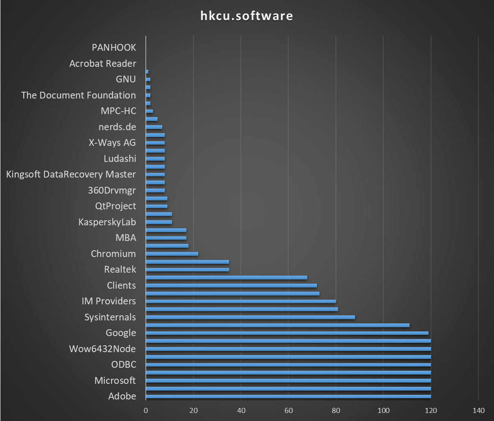
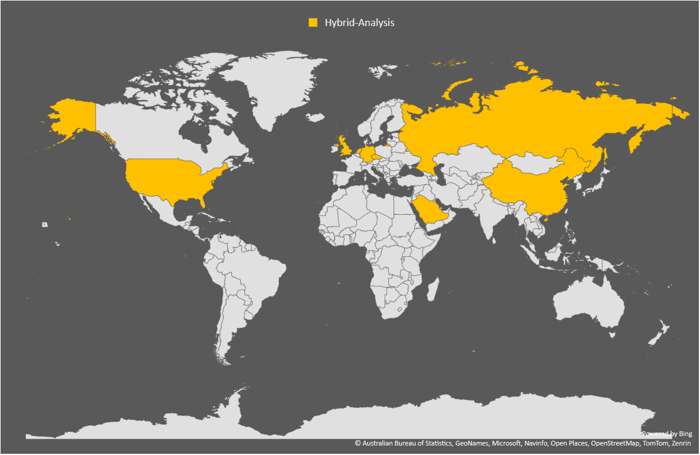
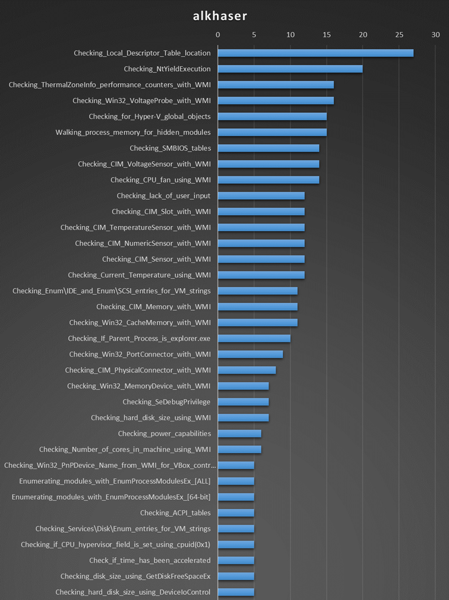
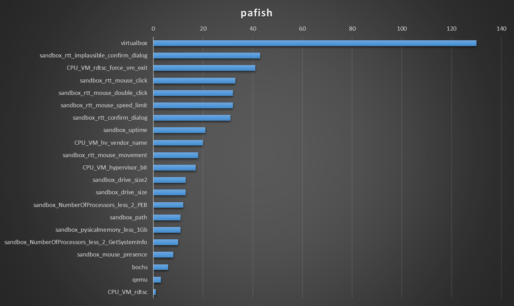
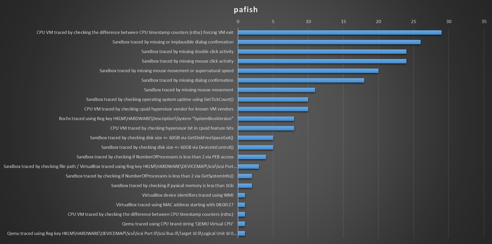

# The state of sandbox evasion techniques in 2024

This post is  about sandbox evasion techniques and their usefulness in more targeted engagements. 

<<<<<<< HEAD
There's a lot of sandbox evasion techniques, some are simple: query WMI, some are cool: parsing SMBIOS tables, most try to detect sandbox artifacts.  I wanted to know if these techniques are still effective for detecting sandboxes, or if the sandboxes have since been updated to counter them.
=======
<<<<<<< HEAD
There's a lot of sandbox evasion techniques, some are simple: query WMI, some are cool: parsing SMBIOS tables, most try to detect sandbox artifacts.  I wanted to know if these techniques are still effective for detecting sandboxes, or if the sandboxes have since been updated to counter them.
=======
<<<<<<< HEAD
There's a lot of sandbox evasion techniques, some are simple: query WMI, some are cool: parsing SMBIOS tables, most try to detect sandbox artifacts.  I wanted to know if these techniques are still effective for detecting sandboxes, or if the sandboxes have since been updated to counter them.
=======
<<<<<<< HEAD
There's a lot of sandbox evasion techniques, some are simple: query WMI, some are cool: parsing SMBIOS tables, most try to detect sandbox artifacts.  I wanted to know if these techniques are still effective for detecting sandboxes, or if the sandboxes have since been updated to counter them.
=======
<<<<<<< HEAD
There's a lot of sandbox evasion techniques, some are simple: query WMI, some are cool: parsing SMBIOS tables, most try to detect sandbox artifacts.  I wanted to know if these techniques are still effective for detecting sandboxes, or if the sandboxes have since been updated to counter them.
=======
There's a lot of sandboxes evasion techniques, some are simple: query WMI, some are cool: parsing SMBIOS tables, most try to detect sandbox artifacts.  I wanted to know if these techniques are still effective for detecting sandboxes, or if the sandboxes have since been updated to counter them.
>>>>>>> 5e780d3 (Updated with:  40e6247)
>>>>>>> 87230ba (Updated with:  799fdcd)
>>>>>>> a89ae3f (Updated with:  f8e6be8)
>>>>>>> 4ef2826 (Updated with:  516f2bd)
>>>>>>> 4b589c7 (Updated with:  be93566)


## Initial enumeration

I selected these four sandboxes for my tests :

- [VirusTotal](https://www.virustotal.com/gui/)
- [Hybrid-Analysis](https://www.hybrid-analysis.com/)
- [RecordedFuture Triage](https://tria.ge/)
- [OWASP MetaDefender Sandbox](https://www.filescan.io/scan)

There were quite a lot more public sandbox services [1] around 2016. But these were the ones I found still active. I also used random URL scanning services after reading this [tweet](https://x.com/0gtweet/status/1797484704196665626) from Grzegorz Tworek.

[1] *On Fingerprinting of Public Malware Analysis
Services*

[1] https://www.christian-rossow.de/publications/sandprint-raid2016.pdf

[1] *Your Sandbox is Blinded:
Impact of Decoy Injection to Public Malware Analysis
Systems*


To perform a quick and dirty enumeration of these sandboxes, I wrote a quick python script to get information about the running processes, installed software and BIOS information (through the registry). All information was going to be sent through HTTP POST requests, as they seemed to be allowed through the sandboxes firewalls. The server that received the results was a simple Flask webserver. 


The BIOS information did not hold any value in determining if the machine was a sandbox.

List of software installed (from the registry) :
<table>
    <tr>
        <td style="border: 0;"></td>
        <td style="border: 0;"></td>
    </tr>
</table>

When listing the directories in the *Program Files* and *Program Files (x86)*, about 10 sandboxes had weird directories :


When listing processes, these are the users that are running software on the machine (including our process). They account for about 33/120ish of sandboxes where the payload was executed.

- WIN-5E07COS9ALR\Abby
- WASP\Janet Van Dyne
- DESKTOP-B0T93D6\george
- JOHN-PC\John
- BUXF-O02J2Q\admin


There were also a lot of sandboxes that were using this sort of pattern for their users:
- DESKTOP-BJNL7RX\vbxKIs2
- DESKTOP-QSVLYYY\dqUyPd5N
- DESKTOP-BYNIGKA\YnYVSXW5Vh5
- DESKTOP-5HLCS0T\Lv3mvD7Wv6L
- DESKTOP-0SWEU7Q\AUlDa

<<<<<<< HEAD
The length of the username varied in length, but the machine is always 7 characters long.
=======
<<<<<<< HEAD
The length of the username varied in length, but the machine is always 7 characters long.
=======
<<<<<<< HEAD
The length of the username varied in length, but the machine is always 7 characters long.
=======
<<<<<<< HEAD
The length of the username varied in length, but the machine is always 7 characters long.
=======
<<<<<<< HEAD
The length of the username varied in length, but the machine is always 7 characters long.
=======
<<<<<<< HEAD
The length of the username varied in length but the machine is always 7 characters long.
=======
<<<<<<< HEAD
The length of the username varied in length but the machine is always 7 characters long.
=======
The length of the username varied in lengthbut the machine is always 7 characters long.
>>>>>>> 7ba5c81 (Updated with:  db869ce)
>>>>>>> 996154c (Updated with:  546ac1e)
>>>>>>> 5e780d3 (Updated with:  40e6247)
>>>>>>> 87230ba (Updated with:  799fdcd)
>>>>>>> a89ae3f (Updated with:  f8e6be8)
>>>>>>> 4ef2826 (Updated with:  516f2bd)
>>>>>>> 4b589c7 (Updated with:  be93566)

Finally, here are the countries that called-back sorted by sandbox. The *GENERIC* one is from *OWASP MetaDefender Sandbox* and other random URL scanning services I could find. 

<table>
    <tr>
        <td style="border: 0;"></td>
        <td style="border: 0;"></td>
    </tr>
    <tr>
        <td style="border: 0;"></td>
        <td style="border: 0;"></td>
    </tr>
</table>


Let's see how evasion techniques fair against these sandboxes.


## Evasion techniques

To help in testing sandbox evasion techniques, I relied on the two following projects :

- [Al-Khaser](https://github.com/LordNoteworthy/al-khaser)
- [Pafish](https://github.com/a0rtega/pafish)

<<<<<<< HEAD
Both tools were modified to send an HTTP request containing the text that is normally printed to the console. The HTTP server was the same Flask application from the exfiltration section but with one caveat, I could not figure out how to use a global variable in C/C++ to use as unique ID (stackoverflow answers were simply :  *read in a condescending tone: "you shouldn't use global variables, here's the better way"*), so I used the source IP as a unique identifier and appending to the log file if the IP was already seen. 
=======
<<<<<<< HEAD
Both tools were modified to send an HTTP request containing the text that is normally printed to the console. The HTTP server was the same Flask application from the exfiltration section but with one caveat, I could not figure out how to use a global variable in C/C++ to use as unique ID (stackoverflow answers were simply :  *read in a condescending tone: "you shouldn't use global variables, here's the better way"*), so I used the source IP as a unique identifier and appending to the log file if the IP was already seen. 
=======
<<<<<<< HEAD
Both tools were modified to send an HTTP request containing the text that is normally printed to the console. The HTTP server was the same Flask application from the exfiltration section but with one caveat, I could not figure out how to use a global variable in C/C++ to use as unique ID (stackoverflow answers were simply :  *read in a condescending tone: "you shouldn't use global variables, here's the better way"*), so I used the source IP as a unique identifier and appending to the log file if the IP was already seen. 
=======
<<<<<<< HEAD
Both tools were modified to send an HTTP request containing the text that is normally printed to the console. The HTTP server was the same Flask application from the exfiltration section but with one caveat, I could not figure out how to use a global variable in C/C++ to use as unique ID (stackoverflow answers were simply :  *read in a condescending tone: "you shouldn't use global variables, here's the better way"*), so I used the source IP as a unique identifier and appending to the log file if the IP was already seen. 
=======
<<<<<<< HEAD
Both tools were modified to send an HTTP request containing the text that is normally printed to the console. The HTTP server was the same Flask application from the exfiltration section but with one caveat, I could not figure out how to use a global variable in C/C++ to use as unique ID (stackoverflow answers were simply :  *read in a condescending tone: "you shouldn't use global variables, here's the better way"*), so I used the source IP as a unique identifier and appending to the log file if the IP was already seen. 
=======
<<<<<<< HEAD
Both tools were modified to send an HTTP request containing the text that is normally printed to the console. The HTTP server was the same Flask application from the exfil section but with one caveat, I could not figure out how to use a global variable in C/C++ to use as unique ID (stackoverflow answers were simply :  *read in a condescending tone: "you shouldn't use global variables, here's the better way"*), so I used the source IP as a unique identifier and appending to the log file if the IP was already seen. 
=======
<<<<<<< HEAD
Both tools were modified to send an HTTP request containing the text that is normally printed to the console. The HTTP server was the same Flask application from the exfil section but with one caveat, I could not figure out how to use a global variable in C/C++ to use as unique ID (stackoverflow answers were simply :  *read in a condescending tone: "you shouldn't use global variables, here's the better way"*), so I used the source IP as a unique identifier and appending to the log file if the IP was already seen. 
=======
Both tools were modified to send an HTTP request containing the text that is normally printed to the console. The HTTP server was the same Flask application from the exfil section but with one caveat, I could not figure out how to use a global variable to use as unique ID (stackoverflow answers were simply :  *read in a condescending tone: "you shouldn't use global variables, blah blah blah"*), so I used the source IP as a unique identifier and appending to the log file if the IP was already seen. 
>>>>>>> 7ba5c81 (Updated with:  db869ce)
>>>>>>> 996154c (Updated with:  546ac1e)
>>>>>>> 5e780d3 (Updated with:  40e6247)
>>>>>>> 87230ba (Updated with:  799fdcd)
>>>>>>> a89ae3f (Updated with:  f8e6be8)
>>>>>>> 4ef2826 (Updated with:  516f2bd)
>>>>>>> 4b589c7 (Updated with:  be93566)

A week after uploading the files to the sandboxes, the results were the following :
- 32 unique IPs for *Al-Khaser* 
- 43 unique IPs for *Pafish*


### Al-Khaser results

*Al-Khaser* detects multiple sandboxes using the *Local Descriptor Table Location* technique, which, quoted directly from the source: 

> *This trick  involves looking at pointers to critical operating system tables
that are typically relocated on a virtual machine. One such table is the
Interrupt Descriptor Table (IDT), which tells the system where various operating
system interrupt handlers are located in memory. On real machines, the IDT is
<<<<<<< HEAD
=======
<<<<<<< HEAD
=======
<<<<<<< HEAD
=======
<<<<<<< HEAD
=======
<<<<<<< HEAD
>>>>>>> 87230ba (Updated with:  799fdcd)
>>>>>>> a89ae3f (Updated with:  f8e6be8)
>>>>>>> 4ef2826 (Updated with:  516f2bd)
>>>>>>> 4b589c7 (Updated with:  be93566)
located lower in memory than it is on guest (i.e., virtual) machines.*

> *PS: Does not seem to work on newer version of VMWare Workstation (Tested on v12)*

I'm not sure if that means that the results are a false positive, but since it should not work on newer versions of VMWare Workstation, let’s ignore it. 

Both *Checking for Hyper-V global objects* and *Checking_SMBIOS_tables* techniques seem to be an effective method to detect sandboxes. Another advantage is they don't get flagged as anti-vm techniques by the sanboxes. 
<<<<<<< HEAD
=======
<<<<<<< HEAD
=======
<<<<<<< HEAD
=======
<<<<<<< HEAD
=======
=======
located lower in memory than it is on guest (i.e., virtual) machines*

> *PS: Does not seem to work on newer version of VMWare Workstation (Tested on v12)*

<<<<<<< HEAD
I'm not sure if that means that the results are a false positive, but since it should not work on newer versions of VMWare Workstation, lets ignore it. 

Both *Checking for Hyper-V global objects* and *Checking_SMBIOS_tables* techniques seem to be an effective method to detect sandboxes. Another advantage is they don't get flagged as anti-vm techniques by the sanboxes. 
=======
<<<<<<< HEAD
I'm not sure if that means that the results are a false positive, but since it should not work on newer versions of VMWare Workstation, lets ignore it. 

Both *Checking for Hyper-V global objects* and *Checking_SMBIOS_tables* techniques seem to be an effective method to detect sandboxes. Another advantage is they don't get flagged as anti-vm techniques by the sanboxes. 
=======

Both the *Checking for Hyper-V global objects* and the *Checking_SMBIOS_tables* techniques seem to be an effective method to detect sandboxes, and they don't get flagged as anti-vm techniques by the sanboxes. 
>>>>>>> 7ba5c81 (Updated with:  db869ce)
>>>>>>> 996154c (Updated with:  546ac1e)
>>>>>>> 5e780d3 (Updated with:  40e6247)
>>>>>>> 87230ba (Updated with:  799fdcd)
>>>>>>> a89ae3f (Updated with:  f8e6be8)
>>>>>>> 4ef2826 (Updated with:  516f2bd)
>>>>>>> 4b589c7 (Updated with:  be93566)




*The data was limited to techniques that detected at least 5 sandboxes*

<<<<<<< HEAD
The *NtYieldExecution* is a antidebugging technique that doesn't seem very reliable as it considers my machine to be a sandbox. The unreliability is also recognized in the source code : 
=======
<<<<<<< HEAD
The *NtYieldExecution* is a antidebugging technique that doesn't seem very reliable as it considers my machine to be a sandbox. The unreliability is also recognized in the source code : 
=======
<<<<<<< HEAD
The *NtYieldExecution* is a antidebugging technique that doesn't seem very reliable as it considers my machine to be a sandbox. The unreliability is also recognized in the source code : 
=======
<<<<<<< HEAD
The *NtYieldExecution* is a antidebugging technique that doesn't seem very reliable as it considers my machine to be a sandbox. The unreliability is also recognized in the source code : 
=======
<<<<<<< HEAD
The *NtYieldExecution* is a antidebugging technique that doesn't seem very reliable as it considers my machine to be a sandbox. The unreliability is also recognized in the source code : 
=======
The *NtYieldExecution* is a antidebugging technique that doesn't seem very reliable as it considers my machine to be a sandbox. The unreliablility is also recognized in the source code : 
>>>>>>> 5e780d3 (Updated with:  40e6247)
>>>>>>> 87230ba (Updated with:  799fdcd)
>>>>>>> a89ae3f (Updated with:  f8e6be8)
>>>>>>> 4ef2826 (Updated with:  516f2bd)
>>>>>>> 4b589c7 (Updated with:  be93566)
> *However, this is a hopelessly unreliable method for detecting a debugger because it will also detect the presence of a thread that is running with high priority*


Most of the other successful detection techniques are based on WMI queries. However, interfacing with WMI is well known, and sandboxes consider these queries as malicious, making them pointless to use for sandbox evasion. 


### Pafish results

I ran two versions of *Pafish*, the first sent a generic log message, the second a more detailed one. I did this as the *virtualbox* detection was trigged multiple times on seven sandboxes that executed the payload, but didn't give me the exact detection technique.



This second iteration did not execute on as many sandboxes as the previous one. That's why there's less *virtualbox* detection techniques in the graph.




<<<<<<< HEAD
=======
<<<<<<< HEAD
=======
<<<<<<< HEAD
=======
<<<<<<< HEAD
=======
<<<<<<< HEAD
=======
<<<<<<< HEAD
=======
<<<<<<< HEAD
>>>>>>> 996154c (Updated with:  546ac1e)
>>>>>>> 5e780d3 (Updated with:  40e6247)
>>>>>>> 87230ba (Updated with:  799fdcd)
>>>>>>> a89ae3f (Updated with:  f8e6be8)
>>>>>>> 4ef2826 (Updated with:  516f2bd)
>>>>>>> 4b589c7 (Updated with:  be93566)
The *rdtsc* technique [2] is documented and well known by malware authors and sandbox authors alike. The technique is useful in detecting sandboxes, but at the same time creates a known malicious IOC. 

[2] [checkpoint research](https://anti-debug.checkpoint.com/techniques/timing.html)

The next techniques in detection ability are linked to user interaction, either with mouse movement and clicks on message boxes. While these techniques are great and abuse the fact that sandbox users are not real users, mouse clicks should be avoided as they place a hook on mouse events which gets detected as *Sets a global windows hook to intercept mouse events*. 

The last technique is checking the uptime of the system. In this case, this is done with the *GetTickCount()* API call but can also be done by manually parsing the *KUSER_SHARED_DATA*, as shown in this blog [3] and documented by the VX-API project [3.1]


[3] https://pentest.party/posts/2024/detecting-sandboxes-without-syscalls/
<<<<<<< HEAD

[3.1] https://github.com/vxunderground/VX-API
=======
<<<<<<< HEAD

[3.1] https://github.com/vxunderground/VX-API
=======
<<<<<<< HEAD

[3.1] https://github.com/vxunderground/VX-API
=======
<<<<<<< HEAD

[3.1] https://github.com/vxunderground/VX-API
=======
<<<<<<< HEAD

[3.1] https://github.com/vxunderground/VX-API
=======
<<<<<<< HEAD

[3.1] https://github.com/vxunderground/VX-API
=======
[3.1] https://github.com/vxunderground/VX-API
=======
The *rdtsc* technique [1] is documented and well known by malware authors and sandbox authors alike. The technique is useful in detecting sandboxes, but at the same time creating a known malicious IOC. 

[1] [checkpoint research](https://anti-debug.checkpoint.com/techniques/timing.html)

The next techniques in detection ability are linked to user interaction, either with mouse movement and clicks on message boxes. While these techniques are great and abuse the fact that sandbox user are not real users, mouse clicks should be avoided as they place a hook on mouse events which gets detected as *Sets a global windows hook to intercept mouse events*. 

The last technique is checking the uptime of the system. In this case, this is done with the *GetTickCount()* API call but can be done by manually parsing the *KUSER_SHARED_DATA* [2].


[2] https://pentest.party/posts/2024/detecting-sandboxes-without-syscalls/
>>>>>>> 7ba5c81 (Updated with:  db869ce)
>>>>>>> 996154c (Updated with:  546ac1e)
>>>>>>> 5e780d3 (Updated with:  40e6247)
>>>>>>> 87230ba (Updated with:  799fdcd)
>>>>>>> a89ae3f (Updated with:  f8e6be8)
>>>>>>> 4ef2826 (Updated with:  516f2bd)
>>>>>>> 4b589c7 (Updated with:  be93566)

The other techniques either use WMI, which we already discarded due to its detection rate, or don't have enough detection capabilities to realistically be used in malware (we don't want to have to chain multiple / a lot of different techniques together).


<<<<<<< HEAD
## Results analysis

A lot of these techniques are well known by antivirus solutions, and even if they do detect sandboxes, the added scrutiny associated with our *totally legitimate program* being classified as malicious is not worth the tradeoff. Furthermore, even if the techniques that are not directly considered to be malicious, they don't detect every sandbox we encountered. Although some candidates can detect most sandboxes like *Local Descriptor Table Location* or *mouse mouvements*, couldn't we use something simpler and less known ?
=======
<<<<<<< HEAD
## Results analysis

A lot of these techniques are well known by antivirus solutions, and even if they do detect sandboxes, the added scrutiny associated with our *totally legitimate program* being classified as malicious is not worth the tradeoff. Furthermore, even if the techniques that are not directly considered to be malicious, they don't detect every sandbox we encountered. Although some candidates can detect most sandboxes like *Local Descriptor Table Location* or *mouse mouvements*, couldn't we use something simpler and less known ?
=======
<<<<<<< HEAD
## Results analysis

A lot of these techniques are well known by antivirus solutions, and even if they do detect sandboxes, the added scrutiny associated with our *totally legitimate program* being classified as malicious is not worth the tradeoff. Furthermore, even if the techniques that are not directly considered to be malicious, they don't detect every sandbox we encountered. Although some candidates can detect most sandboxes like *Local Descriptor Table Location* or *mouse mouvements*, couldn't we use something simpler and less known ?
=======
<<<<<<< HEAD
## Results analysis

A lot of these techniques are well known by antivirus solutions, and even if they do detect sandboxes, the added scrutiny associated with our *totally legitimate program* being classified as malicious is not worth the tradeoff. Furthermore, even if the techniques that are not directly considered to be malicious, they don't detect every sandbox we encountered. Although some candidates can detect most sandboxes like *Local Descriptor Table Location* or *mouse mouvements*, couldn't we use something simpler and less known ?
=======
<<<<<<< HEAD
## Results analysis

A lot of these techniques are well known by antivirus solutions, and even if they do detect sandboxes, the added scrutiny associated with our *totally legitimate program* being classified as malicious is not worth the tradeoff. Furthermore, even if the techniques that are not directly considered to be malicious, they don't detect every sandbox we encountered. Although some candidates can detect most sandboxes like *Local Descriptor Table Location* or *mouse mouvements*, couldn't we use something simpler and less known ?
=======
<<<<<<< HEAD
## Results analysis

A lot of these techniques are well known by antivirus solutions, and even if they do detect sandboxes, the added scrutiny associated with our *totally legitimate program* being classified as malicious is not worth the tradeoff. Furthermore, even the techniques that are not directly considered to be malicious, they don't detect every sandboxes we encountered. Although some candidates can detect most sandboxes like *Local Descriptor Table Location* or *mouse mouvements*, couldn't we use something simpler and less known ?
>>>>>>> 5e780d3 (Updated with:  40e6247)
>>>>>>> 87230ba (Updated with:  799fdcd)
>>>>>>> a89ae3f (Updated with:  f8e6be8)
>>>>>>> 4ef2826 (Updated with:  516f2bd)
>>>>>>> 4b589c7 (Updated with:  be93566)

Sandboxes are, basically, a VM that runs arbitrary programs. We can try to detect which technology it's using, be it VMWARE, VirtualBox, Cuckoo or QEMU, or try to see if the sandbox is moving the mouse cursor, or find sandbox artifacts. At the end of the day, we're still attempting to detect a sandbox by the definition of what a sandbox is, a VM that runs arbitrary programs. 


## Conclusion

<<<<<<< HEAD
In reality, our objective is to get our payload on a real machine, configured by a real IT department, with a real user contributing to shareholder value by trading their limited time for money. Sandboxes cannot capture this profound level of despair.

We should detect what constitutes a real machine, not try to detect what a fake one looks like. Environment keying is how we can do this.
=======
<<<<<<< HEAD
In reality, our objective is to get our payload on a real machine, configured by a real IT department, with a real user contributing to shareholder value by trading their limited time for money. Sandboxes cannot capture this profound level of despair.

We should detect what constitutes a real machine, not try to detect what a fake one looks like. Environment keying is how we can do this.
=======
<<<<<<< HEAD
In reality, our objective is to get our payload on a real machine, configured by a real IT department, with a real user contributing to shareholder value by trading their limited time for money. Sandboxes cannot capture this profound level of despair.

We should detect what constitutes a real machine, not try to detect what a fake one looks like. Environment keying is how we can do this.
=======
<<<<<<< HEAD
In reality, our objective is to get our payload on a real machine, configured by a real IT department, with a real user contributing to shareholder value by trading their limited time for money. Sandboxes cannot capture this profound level of despair.

We should detect what constitutes a real machine, not try to detect what a fake one looks like. Environment keying is how we can do this.
=======
<<<<<<< HEAD
In reality, our objective is to get our payload on a real machine, configured by a real IT department, with a real user contributing to shareholder value by trading their limited time for money. Sandboxes cannot capture this profound level of despair.

We should detect what constitutes a real machine, not try to detect what a fake one looks like. Environment keying is how we can do this.
=======
In reality, our objective is to get our payload on a real machine, configured by a real IT departement, with a real user contributing to shareholder value by trading their limited time for money. Sandboxes cannot capture this profound level of despair.

We should detect what constitues a real machine, not try to detect what a fake one looks like. Environment keying is how we can do this.
>>>>>>> 5e780d3 (Updated with:  40e6247)
>>>>>>> 87230ba (Updated with:  799fdcd)
>>>>>>> a89ae3f (Updated with:  f8e6be8)
>>>>>>> 4ef2826 (Updated with:  516f2bd)
>>>>>>> 4b589c7 (Updated with:  be93566)

I wrote a quick nim program to check Active Directory membership a few different ways [4], office productivity logs [5], and uploaded it to the sandboxes. 

[4] https://github.com/byt3bl33d3r/OffensiveNim/blob/master/src/sandbox_domain_check.nim
<<<<<<< HEAD
=======
<<<<<<< HEAD
=======
<<<<<<< HEAD
=======
<<<<<<< HEAD
=======
<<<<<<< HEAD
=======
=======
<<<<<<< HEAD
## Results analysis
=======

## Conclusion
>>>>>>> 7ba5c81 (Updated with:  db869ce)

A lot of these techniques are well known by antivirus solutions, and even if they do detect sandboxes, the added scrutiny associated with your *totally legitimate program* being classified as malicious is not worth the tradeoff. Furthermore, even the techniques that are not directly considered to be malicious, don't detect every sandboxes we encountered. Although some candidates can detect most sandboxes like *Local Descriptor Table Location* or *mouse mouvements*, couldn't we use something simpler and less known ?

Sandboxes are, basically, a VM that runs arbitrary programs. You can try to detect which technology it's using, be it VMWARE, VirtualBox, Cuckoo or QEMU, or try to see if the sandbox is moving the mouse cursor, or find sandbox artifacts. At the end of the day, you're still attempting to detect a sandbox by the definition of what a sandbox is, a VM that runs arbitrary programs. 

<<<<<<< HEAD

## Conclusion

=======
>>>>>>> 7ba5c81 (Updated with:  db869ce)
In reality, our objective is to get our payload on a real machine, configured by a real IT departement, with a real user contributing to shareholder value by trading their time for money. Sandboxes cannot capture this profound level of despair.

We should detect what constitues a real machine, not try to detect what a fake one looks like. Environment keying is how we can do this.

<<<<<<< HEAD
I wrote a quick nim program to check Active Directory membership a few different ways [4], office productivity logs [5], and uploaded it to the sandboxes. 

[4] https://github.com/byt3bl33d3r/OffensiveNim/blob/master/src/sandbox_domain_check.nim
=======
I wrote a quick nim program to check Active Directory membership a few different ways [3], office productivity logs [4], and uploaded it to the sandboxes. 

[3] https://github.com/byt3bl33d3r/OffensiveNim/blob/master/src/sandbox_domain_check.nim
>>>>>>> 7ba5c81 (Updated with:  db869ce)
>>>>>>> 996154c (Updated with:  546ac1e)
>>>>>>> 5e780d3 (Updated with:  40e6247)
>>>>>>> 87230ba (Updated with:  799fdcd)
>>>>>>> a89ae3f (Updated with:  f8e6be8)
>>>>>>> 4ef2826 (Updated with:  516f2bd)
>>>>>>> 4b589c7 (Updated with:  be93566)


```nim
proc IsAzureJoined2(): bool = 
    proc DsrIsDeviceJoined(
        isDomainJoined: ptr BOOL,
        isAADJoined: ptr BOOL
    ): HRESULT {.stdcall, dynlib: "dsreg", importc.}
    var domainJoined: BOOL = 0
    var aadJoined: BOOL = 0 # doesn't do anything?, the real return is in domainJoined
    let result = DsrIsDeviceJoined(addr domainJoined, addr aadJoined)
    if result == S_OK:
        return domainJoined
```
```nim
# From https://github.com/byt3bl33d3r/OffensiveNim/blob/master/src/ldap_query_bin.nim
proc ADO_ADSI(): bool = 
    var conn = CreateObject("ADODB.Connection")
    conn.Provider = "ADsDSOObject"
    conn.Open("Active Directory Provider")
    var sysinfo = CreateObject("ADSystemInfo")
    try:
        let dn = sysinfo.DomainDNSName
        return true
    except:
        return false
```

<<<<<<< HEAD
[5]
=======
<<<<<<< HEAD
[5]
=======
<<<<<<< HEAD
[5]
=======
<<<<<<< HEAD
[5]
=======
<<<<<<< HEAD
[5]
=======
<<<<<<< HEAD
[5]
=======
<<<<<<< HEAD
[5]
=======
[4]
>>>>>>> 7ba5c81 (Updated with:  db869ce)
>>>>>>> 996154c (Updated with:  546ac1e)
>>>>>>> 5e780d3 (Updated with:  40e6247)
>>>>>>> 87230ba (Updated with:  799fdcd)
>>>>>>> a89ae3f (Updated with:  f8e6be8)
>>>>>>> 4ef2826 (Updated with:  516f2bd)
>>>>>>> 4b589c7 (Updated with:  be93566)
```nim
proc file_outlooklogs(): int = 
    let path = getHomeDir() / "AppData" / "Local" / "Temp" / "Outlook Logging"
    let filesInPath = toSeq(walkDir(path)) 
    return filesInPath.len
```

The results, albeit only 13, were immediately clear.

```json
{"domainjoined":[{"IsDomainJoined":false},{"ADO_ADSI":false},{"IsAzureJoined2":false}],"officeActivityLogs":0}
{"domainjoined":[{"IsDomainJoined":false},{"ADO_ADSI":false},{"IsAzureJoined2":false}],"officeActivityLogs":0}
{"domainjoined":[{"IsDomainJoined":false},{"ADO_ADSI":false},{"IsAzureJoined2":true}],"officeActivityLogs":271} <-- That's my corporate laptop
{"domainjoined":[{"IsDomainJoined":false},{"ADO_ADSI":false},{"IsAzureJoined2":false}],"officeActivityLogs":0,}
{"domainjoined":[{"IsDomainJoined":false},{"ADO_ADSI":false},{"IsAzureJoined2":false}],"officeActivityLogs":0,}
{"domainjoined":[{"IsDomainJoined":false},{"ADO_ADSI":false},{"IsAzureJoined2":false}],"officeActivityLogs":}
{"domainjoined":[{"IsDomainJoined":false},{"ADO_ADSI":false},{"IsAzureJoined2":false}],"officeActivityLogs":}
{"domainjoined":[{"IsDomainJoined":false},{"ADO_ADSI":false},{"IsAzureJoined2":false}],"officeActivityLogs":1}
{"domainjoined":[{"IsDomainJoined":false},{"ADO_ADSI":false},{"IsAzureJoined2":false}],"officeActivityLogs":0}
{"domainjoined":[{"IsDomainJoined":false},{"ADO_ADSI":false},{"IsAzureJoined2":false}],"officeActivityLogs":}
{"domainjoined":[{"IsDomainJoined":false},{"ADO_ADSI":false},{"IsAzureJoined2":false}],"officeActivityLogs":}
{"domainjoined":[{"IsDomainJoined":false},{"ADO_ADSI":false},{"IsAzureJoined2":false}],"officeActivityLogs":}
{"domainjoined":[{"IsDomainJoined":false},{"ADO_ADSI":false},{"IsAzureJoined2":false}],"officeActivityLogs":}
{"domainjoined":[{"IsDomainJoined":false},{"ADO_ADSI":false},{"IsAzureJoined2":false}],"officeActivityLogs":2}
{"domainjoined":[{"IsDomainJoined":false},{"ADO_ADSI":false},{"IsAzureJoined2":false}],"officeActivityLogs":0}
```

<<<<<<< HEAD
=======
<<<<<<< HEAD
=======
<<<<<<< HEAD
=======
<<<<<<< HEAD
>>>>>>> a89ae3f (Updated with:  f8e6be8)
>>>>>>> 4ef2826 (Updated with:  516f2bd)
>>>>>>> 4b589c7 (Updated with:  be93566)
None of these sandboxes were domain joined, or had any indication of Word, Excel or Powerpoint activity. They are not *real* corporate machines. Moreover, these sandboxes did not flag this code as *attempting to detect virtual environments, specific VMs or using anti-sandbox techniques*. (Apart from the detections for just being nim code). 

After uploading a bunch of files and getting free compute from these very nice sandbox vendors, it's apparent that while more complicated or interesting techniques might be required for malware that targets personal computers, using them for targeted engagements doesn't seem to add as much value. 


----------------

Thanks for reading,<br>
Fudgedotdotdot
<p>
> Created: 02.09.2024 <br/>
> Modified: {{ file.mtime  }}
</p>
<<<<<<< HEAD
=======
<<<<<<< HEAD
=======
<<<<<<< HEAD
=======
=======
<<<<<<< HEAD
None of these sandboxes were domain joined, or had any indication of Word, Excel or Powerpoint activity. They are not *real* corporate machines. Moreover, these sandboxes did not flag this code as *attempting to detect virtual environments, specific VMs or using anti-sandbox techniques*. (Apart from the detections for just being nim code). 

After uploading a bunch of files and getting free compute from these very nice sandbox vendors, it's apparent that while more complicated or interesting techniques might be required for malware that targets personal computers, using them for targeted engagements doesn't seem to add as much value. 
=======
None of these sandboxes were domain joined, or had any indication of Word, Excel or Powerpoint activity. They are not *real* corporate machines. Moreover, these sandboxes did not flag this code as *attempting to detect virtual environments, specific VMs or using anti-sandbox techniques*. (apart from the detections for just being nim code). 

<<<<<<< HEAD
After uploading a bunch of files and getting free compute from these very nice sandbox vendors, it's apparent that while more complicated or interesting techniques might be required for malware that targets personal computers, using them for targeted engagements doesn't seem to add as much value. 
=======
While more complicated or cool techniques might be required for malware that targets personal computers, using them for targeted engagements doesn't seem to add as much value. 
>>>>>>> 996154c (Updated with:  546ac1e)
>>>>>>> 5e780d3 (Updated with:  40e6247)


>>>>>>> 87230ba (Updated with:  799fdcd)
>>>>>>> a89ae3f (Updated with:  f8e6be8)
>>>>>>> 4ef2826 (Updated with:  516f2bd)
>>>>>>> 4b589c7 (Updated with:  be93566)


